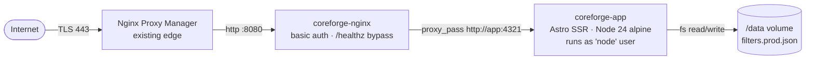

# CoreForge — Conveyor Filters

Web app to design, organize and share **Rust industrial conveyor** presets.

In Rust (the game) the _Industrial Conveyor_ moves items between containers based on per-slot filters. Building those filters in-game is fiddly — tiny UI, no copy/paste, no way to reuse a config across bases or wipes. **CoreForge** lets you build presets in a comfortable browser UI, group them into categories/subcategories, and copy/paste the exact JSON the game accepts.

Part of the personal _Forge_ ecosystem of Rust tooling.

---

## What you get

- Categories + subcategories, each with rename/delete and an _Open Core filter_ flag.
- Up to 30 items per filter with `Max / Buffer / Min` per slot.
- A cover item + a destination box image per filter.
- Import / Export of the raw conveyor JSON the game produces.
- File-based persistence — the whole app state is a single JSON file (no DB).
- Production deploy with `nginx` + HTTP basic auth, designed to sit behind an existing Nginx Proxy Manager.

---

## Architecture (production)



- The **app** container has no host port published. It is only reachable from `nginx` over the internal compose network.
- **nginx** is the only public entrypoint, on a configurable host port (default `8080`) so it can coexist with NPM owning `80/443`.
- The `/data` named volume is the only piece of state worth backing up.

---

## Tech stack

| Layer                | Choice                                                                                                               |
| -------------------- | -------------------------------------------------------------------------------------------------------------------- |
| Framework            | [Astro 6](https://astro.build) with `output: 'server'`                                                               |
| Server adapter       | `@astrojs/node` (standalone mode)                                                                                    |
| UI                   | [Preact 10](https://preactjs.com) + [`@preact/signals`](https://preactjs.com/guide/v10/signals/) for reactive stores |
| Styling              | [Tailwind CSS 4](https://tailwindcss.com) (Vite plugin)                                                              |
| Persistence          | Plain JSON file on disk, served by an Astro API route (`GET`/`PUT /api/filters`)                                     |
| Runtime              | Node 22+ in dev · Node 24 alpine in the production image                                                             |
| Reverse proxy / auth | `nginx:1.27-alpine` with `.htpasswd` (bcrypt)                                                                        |
| CI/CD                | GitHub Actions → Docker Hub (`negrii/coreforge-conveyor-filters`, multi-arch `amd64`/`arm64`)                        |

---

## Project layout

```
src/
├── components/         # Preact islands (FilterForm, modals, cards…)
├── data/               # Static seed (items.json, box.json, categories.json) + filters.*.json
├── layouts/            # Astro layouts (header / footer)
├── lib/                # Tiny utilities (clipboard…)
├── pages/
│   ├── index.astro     # Home: categories + filters
│   ├── filters/
│   │   ├── new.astro   # Create filter
│   │   └── edit.astro  # Edit filter
│   └── api/filters.ts  # GET / PUT — reads & writes filters.*.json
├── store/              # Signals-based stores: filters, items, boxes
└── types/              # Shared TypeScript types
nginx/conf.d/           # Reverse-proxy config (used only by the prod compose stack)
.github/workflows/      # docker-publish.yml
Dockerfile              # Multi-stage app image (Node 24 alpine + tini, non-root)
docker-compose.yml      # Prod stack: app + nginx + named volume
```

---

## Development

```sh
npm install
npm run dev
```

Server starts at <http://localhost:4321>. State is persisted to `src/data/filters.dev.json` (gitignored).

Useful commands:

| Command           | Action                                   |
| ----------------- | ---------------------------------------- |
| `npm run dev`     | Astro dev server with HMR                |
| `npm run build`   | Build the production bundle to `./dist/` |
| `npm run preview` | Run the built bundle locally             |
| `npx astro check` | Type-check the project                   |

> The dev store and the prod store are different files (`filters.dev.json` vs `filters.prod.json`). You can edit the dev one freely without touching prod data.

---

## Production deploy (Docker)

The compose stack runs two containers:

1. **app** — Node 24 alpine, runs as the unprivileged `node` user, no host port published, persists state to a named volume.
2. **nginx** — `nginx:1.27-alpine`, the only entrypoint, gates everything with HTTP basic auth (except `/healthz`).

### 1. Create basic-auth credentials

The bind-mounted `secrets/htpasswd` is required — compose refuses to start without it. Generate it once per host:

```sh
mkdir -p secrets
docker run --rm httpd:2.4-alpine htpasswd -Bbn negrii 'CHANGE_ME' > secrets/htpasswd
chmod 600 secrets/htpasswd
```

- `-B` uses bcrypt.
- Add more users with `>>` instead of `>`.
- Reload without downtime: `docker compose exec nginx nginx -s reload`.
- `secrets/` is gitignored.

### 2. Choose the host port (optional)

NPM owns `80/443`, so nginx publishes on a custom port. Default is `8080`:

```sh
echo "COREFORGE_PORT=8080" > .env
```

### 3. Build and run

```sh
docker compose up -d --build
docker compose logs -f
```

Then point an NPM Proxy Host at `http://<host>:${COREFORGE_PORT}` (or at `coreforge-nginx:80` if NPM shares the docker network), turn on Force SSL, and you're done. The internal nginx applies basic auth on every request.

### Environment variables (app container)

| Var        | Default      | Notes                                                                                       |
| ---------- | ------------ | ------------------------------------------------------------------------------------------- |
| `HOST`     | `0.0.0.0`    | Astro standalone bind address                                                               |
| `PORT`     | `4321`       | Astro standalone port (internal only)                                                       |
| `DATA_DIR` | `/data`      | Where `filters.prod.json` is read/written. Locally (no Docker) it falls back to `src/data/` |
| `NODE_ENV` | `production` |                                                                                             |

### Compose-level variables

| Var              | Default | Notes                           |
| ---------------- | ------- | ------------------------------- |
| `COREFORGE_PORT` | `8080`  | Host port nginx is published on |

---

## Data persistence & backup

The full app state lives in **one JSON file**: `filters.prod.json` inside `DATA_DIR` (the `coreforge-data` named volume in compose).

Quick backup:

```sh
docker run --rm -v coreforge-data:/data -v "$PWD":/backup busybox \
  cp /data/filters.prod.json /backup/coreforge-$(date +%Y%m%d).json
```

Restore: copy the file back into the volume and restart the app.

---

## Continuous delivery

`.github/workflows/docker-publish.yml` builds multi-arch (`linux/amd64`, `linux/arm64`) on every push to `main`/`master` and publishes to Docker Hub:

- `negrii/coreforge-conveyor-filters:<package.json version>`
- `negrii/coreforge-conveyor-filters:latest`

Required repository secrets:

- `DOCKERHUB_USERNAME` — `negrii`
- `DOCKERHUB_TOKEN` — Docker Hub Access Token (scope: _Read & Write_)

To cut a release: bump `version` in `package.json`, commit, push to `main`. The workflow re-tags `latest` and publishes the versioned image.

---

## Credits

Personal project. Item names, icons and category metadata come from the public Rust item dump and are property of Facepunch Studios.
