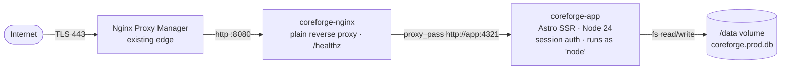

# CoreForge — Conveyor Filters

Web app to design, organize and share **Rust industrial conveyor** presets.

In Rust (the game) the _Industrial Conveyor_ moves items between containers based on per-slot filters. Building those filters in-game is fiddly — tiny UI, no copy/paste, no way to reuse a config across bases or wipes. **CoreForge** lets you build presets in a comfortable browser UI, group them into categories/subcategories, and copy/paste the exact JSON the game accepts.

Part of the personal _Forge_ ecosystem of Rust tooling.

---

## What you get

- Categories + subcategories, each with rename/delete and an _Open Core filter_ flag.
- Up to 30 items per filter with `Max / Buffer / Min` per slot.
- A cover item + a destination box image per filter.
- Import / Export of the raw conveyor JSON the game produces.
- Per-user accounts (username + password), with optional **clans**: every user can create or join one clan, mark any of their filters as "shared with the clan", and clone other members' shared filters into their own space.
- SQLite for everything (users, sessions, clans, filters). One DB file inside the `/data` volume — easy to back up.
- Production deploy with `nginx` purely as a reverse proxy in front of the app's own session auth, designed to sit behind an existing Nginx Proxy Manager.

---

## Architecture (production)



- The **app** container has no host port published. It is only reachable from `nginx` over the internal compose network.
- **nginx** is the only public entrypoint, on a configurable host port (default `8080`) so it can coexist with NPM owning `80/443`. It does no auth — the Astro app handles sessions itself.
- The `/data` named volume holds the SQLite DB and is the only piece of state worth backing up.

---

## Tech stack

| Layer          | Choice                                                                                                               |
| -------------- | -------------------------------------------------------------------------------------------------------------------- |
| Framework      | [Astro 6](https://astro.build) with `output: 'server'`                                                               |
| Server adapter | `@astrojs/node` (standalone mode)                                                                                    |
| UI             | [Preact 10](https://preactjs.com) + [`@preact/signals`](https://preactjs.com/guide/v10/signals/) for reactive stores |
| Styling        | [Tailwind CSS 4](https://tailwindcss.com) (Vite plugin)                                                              |
| Persistence    | SQLite via [`better-sqlite3`](https://github.com/WiseLibs/better-sqlite3) + [Drizzle ORM](https://orm.drizzle.team)  |
| Auth           | App-managed sessions: argon2id passwords (`@node-rs/argon2`), httpOnly+SameSite=Lax cookie, CSRF via Origin check    |
| Runtime        | Node 22+ in dev · Node 24 slim in the production image                                                               |
| Reverse proxy  | `nginx:1.27-alpine`, plain pass-through                                                                              |
| CI/CD          | GitHub Actions → Docker Hub (`negrii/coreforge-conveyor-filters`, multi-arch `amd64`/`arm64`)                        |

---

## Project layout

```
src/
├── components/         # Preact islands (FilterForm, modals, cards…)
├── data/               # Static seed (items.json, box.json, categories.json) + filters.*.json
├── layouts/            # Astro layouts (header / footer)
├── lib/                # Tiny utilities (clipboard…)
├── pages/
│   ├── index.astro     # Home: categories + filters
│   ├── filters/
│   │   ├── new.astro   # Create filter
│   │   └── edit.astro  # Edit filter
│   └── api/filters.ts  # GET / PUT — reads & writes filters.*.json
├── store/              # Signals-based stores: filters, items, boxes
└── types/              # Shared TypeScript types
nginx/conf.d/           # Reverse-proxy config (used only by the prod compose stack)
.github/workflows/      # docker-publish.yml
Dockerfile              # Multi-stage app image (Node 24 alpine + tini, non-root)
docker-compose.yml      # Prod stack: app + nginx + named volume
```

---

## Development

```sh
npm install
npm run dev
```

Server starts at <http://localhost:4321>. The SQLite DB is created at `src/data/coreforge.dev.db` on first request (gitignored). Sign up at `/register` to create your first user.

Useful commands:

| Command           | Action                                   |
| ----------------- | ---------------------------------------- |
| `npm run dev`     | Astro dev server with HMR                |
| `npm run build`   | Build the production bundle to `./dist/` |
| `npm run preview` | Run the built bundle locally             |
| `npx astro check` | Type-check the project                   |

> The dev DB and the prod DB are separate files (`coreforge.dev.db` vs `coreforge.prod.db`). You can hack on the dev one freely without touching prod data.

---

## Production deploy (Docker)

The compose stack runs two containers:

1. **app** — Node 24 slim, runs as the unprivileged `node` user, no host port published, persists state to a named volume.
2. **nginx** — `nginx:1.27-alpine`, the only public entrypoint, plain reverse proxy with no auth of its own.

### 1. Choose the host port (optional)

NPM owns `80/443`, so nginx publishes on a custom port. Default is `8080`:

```sh
echo "COREFORGE_PORT=8080" > .env
```

### 2. Build and run

```sh
docker compose up -d --build
docker compose logs -f
```

Then point an NPM Proxy Host at `http://<host>:${COREFORGE_PORT}` (or at `coreforge-nginx:80` if NPM shares the docker network), turn on Force SSL, and you're done. Anyone can hit `/register` and create an account; lock that down at the NPM/firewall layer if you only want known users to register.

### Environment variables (app container)

| Var        | Default      | Notes                                                                                       |
| ---------- | ------------ | ------------------------------------------------------------------------------------------- |
| `HOST`     | `0.0.0.0`    | Astro standalone bind address                                                               |
| `PORT`     | `4321`       | Astro standalone port (internal only)                                                       |
| `DATA_DIR` | `/data`      | Where `coreforge.prod.db` is read/written. Locally (no Docker) it falls back to `src/data/` |
| `NODE_ENV` | `production` |                                                                                             |

### Compose-level variables

| Var              | Default | Notes                           |
| ---------------- | ------- | ------------------------------- |
| `COREFORGE_PORT` | `8080`  | Host port nginx is published on |

---

## Data persistence & backup

The full app state lives in **one SQLite file**: `coreforge.prod.db` inside `DATA_DIR` (the `coreforge-data` named volume in compose). WAL mode is on, so there may also be `coreforge.prod.db-wal` / `-shm` files — back them up together or run `sqlite3 coreforge.prod.db 'VACUUM INTO ...'` for a single clean copy.

Quick backup (online, consistent — uses SQLite's online backup API via VACUUM):

```sh
docker compose exec app sh -c 'sqlite3 /data/coreforge.prod.db ".backup /data/coreforge.bak"'
docker run --rm -v coreforge-data:/data -v "$PWD":/backup busybox \
  cp /data/coreforge.bak /backup/coreforge-$(date +%Y%m%d).db
```

Restore: stop the app, copy the file back into the volume as `coreforge.prod.db`, restart.

---

## Continuous delivery

`.github/workflows/docker-publish.yml` builds multi-arch (`linux/amd64`, `linux/arm64`) on every push to `main`/`master` and publishes to Docker Hub:

- `negrii/coreforge-conveyor-filters:<package.json version>`
- `negrii/coreforge-conveyor-filters:latest`

Required repository secrets:

- `DOCKERHUB_USERNAME` — `negrii`
- `DOCKERHUB_TOKEN` — Docker Hub Access Token (scope: _Read & Write_)

To cut a release: bump `version` in `package.json`, commit, push to `main`. The workflow re-tags `latest` and publishes the versioned image.

---

## Credits

Personal project. Item names, icons and category metadata come from the public Rust item dump and are property of Facepunch Studios.
