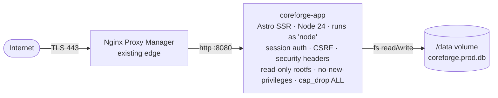

# CoreForge — Conveyor Filters

Web app to design, organize and share **Rust industrial conveyor** presets.

In Rust (the game) the _Industrial Conveyor_ moves items between containers based on per-slot filters. Building those filters in-game is fiddly — tiny UI, no copy/paste, no way to reuse a config across bases or wipes. **CoreForge** lets you build presets in a comfortable browser UI, group them into categories/subcategories, and copy/paste the exact JSON the game accepts.

Part of the personal _Forge_ ecosystem of Rust tooling.

---

## What you get

- Categories + subcategories, each with rename/delete and an _Open Core filter_ flag.
- Up to 30 items per filter with `Max / Buffer / Min` per slot.
- A cover item + a destination box image per filter.
- Import / Export of the raw conveyor JSON the game produces.
- Per-user accounts (username + password), with optional **clans**: every user can create or join one clan, mark any of their filters as "shared with the clan", and clone other members' shared filters into their own space.
- SQLite for everything (users, sessions, clans, filters). One DB file inside the `/data` volume — easy to back up.
- Single-container production deploy: the app handles its own session auth, CSRF (Origin checks) and security headers, so no reverse-proxy sidecar is needed. Designed to sit behind an existing TLS-terminating proxy (e.g. Nginx Proxy Manager).

---

## Architecture (production)



- One **app** container, published on a configurable host port (default `8080`) so it coexists with NPM owning `80/443`.
- It runs as the unprivileged `node` user, with a read-only root filesystem (only `/data` and a small `/tmp` tmpfs are writable), `no-new-privileges`, and all Linux capabilities dropped.
- The `/data` named volume holds the SQLite DB and is the only piece of state worth backing up.

---

## Tech stack

| Layer          | Choice                                                                                                               |
| -------------- | -------------------------------------------------------------------------------------------------------------------- |
| Framework      | [Astro 6](https://astro.build) with `output: 'server'`                                                               |
| Server adapter | `@astrojs/node` (standalone mode)                                                                                    |
| UI             | [Preact 10](https://preactjs.com) + [`@preact/signals`](https://preactjs.com/guide/v10/signals/) for reactive stores |
| Styling        | [Tailwind CSS 4](https://tailwindcss.com) (Vite plugin)                                                              |
| Persistence    | SQLite via [`better-sqlite3`](https://github.com/WiseLibs/better-sqlite3) + [Drizzle ORM](https://orm.drizzle.team)  |
| Auth           | App-managed sessions: argon2id passwords (`@node-rs/argon2`), httpOnly+SameSite=Lax cookie, CSRF via Origin check    |
| Runtime        | Node 22+ in dev · Node 24 slim in the production image                                                               |
| CI/CD          | GitHub Actions → Docker Hub (`negrii/coreforge-conveyor-filters`, multi-arch `amd64`/`arm64`)                        |

---

## Project layout

```
src/
├── components/         # Preact islands (FilterForm, modals, cards…)
├── data/               # Static seed (items.json, box.json, categories.json) + filters.*.json
├── layouts/            # Astro layouts (header / footer)
├── lib/                # Tiny utilities (clipboard…)
├── pages/
│   ├── index.astro     # Home: My Conveyors (Open Cores) + categories
│   ├── login.astro / register.astro / account.astro
│   ├── opencore/ org/  # Open Core + clan pages
│   ├── filters/
│   │   ├── new.astro   # Create filter
│   │   └── edit.astro  # Edit filter
│   └── api/            # auth, me, org, … JSON endpoints (SQLite-backed)
├── db/                 # SQLite client + schema (better-sqlite3 + Drizzle)
├── lib/auth/           # sessions, cookies, password hashing, CSRF, rate-limit
├── middleware.ts       # auth gating + CSRF + security headers
├── store/              # Signals-based stores: filters, items, boxes, auth, org
└── types/              # Shared TypeScript types
.github/workflows/      # docker-publish.yml
Dockerfile              # Multi-stage app image (Node 24 slim, non-root)
docker-compose.yml      # Prod stack: app + named volume
```

---

## Development

```sh
npm install
npm run dev
```

`npm run dev` binds to `127.0.0.1:3000` and opens the browser (`astro dev --host 127.0.0.1 --port 3000 --open`) — so the app is at <http://localhost:3000>. Override with `npm run dev -- --port <n>` if 3000 is taken. The SQLite DB is created at `src/data/coreforge.dev.db` on first request (gitignored). Sign up at `/register` to create your first user.

> Requires Node ≥ 22.12 (`engines`); the repo ships an `.nvmrc` pinning Node 24. The first install builds/downloads native modules (`better-sqlite3`, `@node-rs/argon2`) — prebuilt binaries are used when available.

Useful commands:

| Command                | Action                                          |
| ---------------------- | ----------------------------------------------- |
| `npm run dev`          | Astro dev server with HMR on `:3000`            |
| `npm run build`        | Build the production bundle to `./dist/`        |
| `npm run preview`      | Run the built bundle locally                    |
| `npx astro check`      | Type-check the project (there is no test suite) |
| `npm run format`       | Prettier `--write` over the repo                |
| `npm run format:check` | Prettier check only                             |

> The dev DB and the prod DB are separate files (`coreforge.dev.db` vs `coreforge.prod.db`). You can hack on the dev one freely without touching prod data. Delete `src/data/coreforge.dev.db*` to start from a clean slate.

---

## Production deploy (Docker)

The compose stack runs a single container: **app** — pulled from Docker Hub (`negrii/coreforge-conveyor-filters:latest`), Node 24 slim, runs as the unprivileged `node` user, read-only root filesystem, `no-new-privileges`, all capabilities dropped, state persisted to a named volume.

### Pull and run

```sh
docker compose pull
docker compose up -d
docker compose logs -f
```

The app publishes on host port `8080` (your edge proxy owns `80/443`). To change it, edit the `ports:` mapping in `docker-compose.yml` — and if the proxy runs on the same host, bind it to `127.0.0.1` there so it isn't reachable directly from the network.

Then point an NPM Proxy Host at `http://<host>:8080` (or at `coreforge-app:4321` if NPM shares the docker network), turn on Force SSL, and you're done. Anyone can hit `/register` and create an account; lock that down at the NPM/firewall layer if you only want known users to register.

### Environment variables (app container)

| Var        | Default      | Notes                                                                                       |
| ---------- | ------------ | ------------------------------------------------------------------------------------------- |
| `HOST`     | `0.0.0.0`    | Astro standalone bind address                                                               |
| `PORT`     | `4321`       | Astro standalone port (inside the container)                                                |
| `DATA_DIR` | `/data`      | Where `coreforge.prod.db` is read/written. Locally (no Docker) it falls back to `src/data/` |
| `NODE_ENV` | `production` |                                                                                             |

---

## Data persistence & backup

The full app state lives in **one SQLite file**: `coreforge.prod.db` inside `DATA_DIR` (the `coreforge-data` named volume in compose). WAL mode is on, so there may also be `coreforge.prod.db-wal` / `-shm` files alongside it.

The simplest consistent backup is to stop the app and copy the volume:

```sh
docker compose stop app
docker run --rm -v coreforge-data:/data -v "$PWD":/backup busybox \
  sh -c 'cp /data/coreforge.prod.db* /backup/'
docker compose start app
```

(The image itself ships no `sqlite3` CLI. If you want a hot backup, run `sqlite3` from a throwaway container mounting the same volume, or use any SQLite GUI against the copied file.)

Restore: stop the app, copy the file(s) back into the volume as `coreforge.prod.db` (+ `-wal`/`-shm` if present), restart.

---

## Continuous delivery

`.github/workflows/docker-publish.yml` runs on every push to `main`/`master`. It always type-checks (`astro check`), but it **only builds & publishes a Docker image when `version` in `package.json` changed** vs the previous commit — so pushing code without a version bump ships nothing. When the version did change it builds multi-arch (`linux/amd64`, `linux/arm64`) and pushes to Docker Hub:

- `negrii/coreforge-conveyor-filters:<package.json version>`
- `negrii/coreforge-conveyor-filters:latest`

Required repository secrets:

- `DOCKERHUB_USERNAME` — `negrii`
- `DOCKERHUB_TOKEN` — Docker Hub Access Token (scope: _Read & Write_)

To cut a release: bump `version` in `package.json`, commit, push to `main`. The workflow re-tags `latest` and publishes the versioned image.

---

## Credits

Personal project. Item names, icons and category metadata come from the public Rust item dump and are property of Facepunch Studios.
